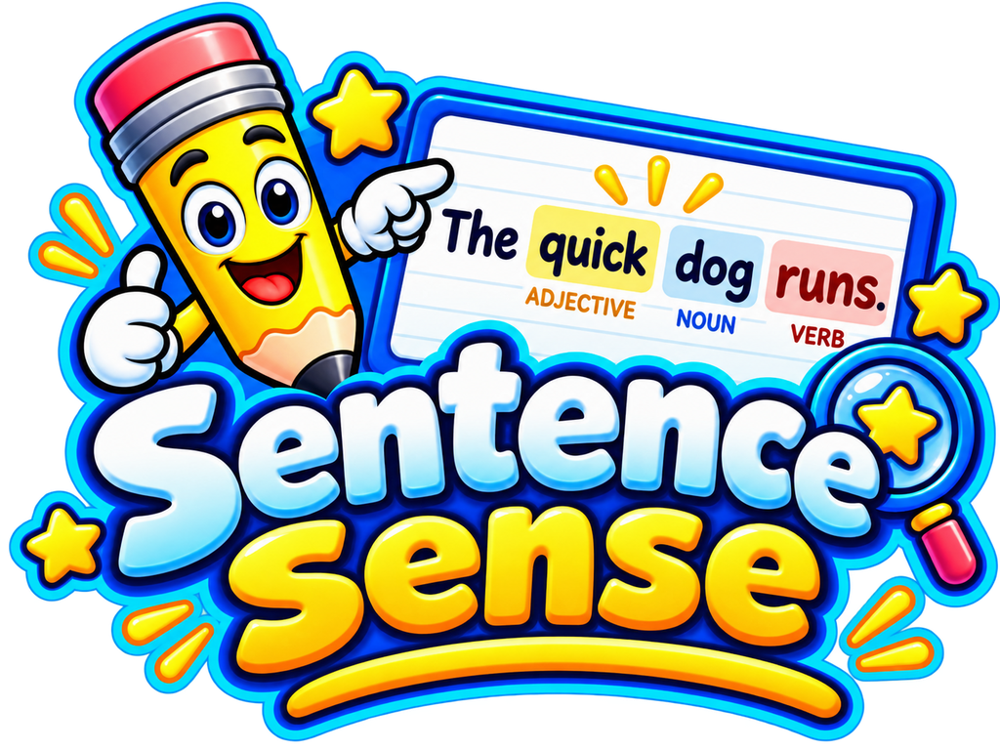

# SENTENCE SENSE — BUILD 1.2 AUDIT REPORT
## Home Page Redesign

**Build:** Sentence Sense — Build 1.2
**Scope:** Home page (portal) redesign only
**Date of audit:** 2026-09-07
**Audited by:** build-time self-audit (automated measurement + visual render inspection)

---

## 1. BUILD SUMMARY

Build 1.2 replaces the Build 1.1.1 home screen with a purpose-built **portal**.

The governing rule for this build was:

> **PORTAL = CHOICE. MODE = DEPTH.**

The home page now has exactly one job: help a 3rd-grade child choose between Learn,
Practice, Break It Down, and Test. Every element that taught, sequenced, or explained
has been removed from Home and left to the modes themselves.

**What changed**

- The home screen was rebuilt from scratch as a full-bleed portal: brand header, a
  three-line hero, and four mode cards.
- The Build 1.1.1 home content — the strategy strip, the topic cards, and the
  instructional sequence — was removed from Home. (The strategy content still exists
  inside Learn Mode's topic screen, where it belongs. It was not deleted from the app.)
- Each mode card follows one hierarchy: **MODE → SHORT PURPOSE → ACTION**.
- Routing to all four modes was preserved; the three unbuilt modes still reach their
  existing placeholder screens.

**What did not change**

- Learn Mode: topic content, topic order, the Definition → Clue → Example → Try It
  structure, the Study Guides, the verb word lists, and the projector typography are
  all untouched. `js/learn.js` and `js/data/learn-content.js` were not modified.
- No Practice, Break It Down, or Test functionality was built.

**One code change was made during this audit rather than after it.** Section 15 and
Section 10 describe it in full: the mode button's maximum font size was reduced from
`1.05rem` to `1rem` after measurement showed the longest button label had only 0.5px of
horizontal headroom at viewports ≥1600px. Everything in this report was re-measured
after that change.

**Verdict:** Pass, with two cosmetic issues and one environmental limitation, all
recorded in Sections 14 and 15.

---

## 2. FIRST-PRINCIPLES DESIGN RULES USED

These rules were derived from the job the page has to do, not from the reference image.
The reference image was consulted only for visual direction (Section 6).

**Rule 1 — A portal presents a choice, not a lesson.**
If the child has to read instructional content before choosing, the portal has failed at
its only job. Nothing on Home teaches. The longest sentence on the page is five words.

**Rule 2 — Four options is the entire decision.**
The page shows four cards and nothing else that can be clicked. There is no fifth path,
no settings, no secondary navigation. A child cannot get lost on a page with four doors.

**Rule 3 — Every card answers the same three questions in the same order.**
*What is it? (MODE) → What will I do there? (SHORT PURPOSE) → How do I start? (ACTION).*
Identical structure across all four cards means the child learns the pattern once and
reads the remaining three cards faster.

**Rule 4 — The action must look like an action.**
Each card ends with a solid, full-width, high-contrast button carrying a verb phrase
("Start Learning"), not a label ("Learn"). The arrow reinforces forward motion.

**Rule 5 — Colour is redundant, never load-bearing.**
Each mode has its own colour, but every card is fully identified by its icon, its title,
its description, and its button text. A colour-blind child loses no information.

**Rule 6 — One tab stop per mode.**
The real control is the `<button>` inside each card. The card itself is clickable as a
large forgiving target for an imprecise tap, but it is not focusable — so keyboard users
get exactly four stops, and screen-reader users hear each mode announced once, not twice.

**Rule 7 — Decoration must never compete with the choice.**
Background shapes sit behind opaque cards. The two motivational accents are shown only
at viewport sizes where they provably cannot reach the cards.

**Rule 8 — Reading level is a design constraint.**
All card descriptions are short, concrete, and in the imperative or plain declarative.
No word on the page is above a 3rd-grade reading level.

---

## 3. SCOPE

**In scope**

- The `#screen-home` section of `index.html`
- The home portal CSS (Sections 5, 7, and the home half of Section 8 in `css/styles.css`)
- Home-screen event wiring and the build number in `js/app.js`
- Verification that routing from Home into all four modes still works
- Regression verification that Learn Mode was not affected

**Explicitly out of scope**

- Practice Mode, Break It Down, and Test — not started, not designed, not stubbed beyond
  the existing placeholders
- Any redesign of Learn Mode
- Any account, login, settings, or profile functionality (see Section 7)
- Build 1.3

---

## 4. FILES CHANGED

| File | Status | What changed |
|---|---|---|
| `index.html` | Modified | `#screen-home` replaced entirely (decor layer, header, hero, four-card grid, two accents). Learn/lesson/mode/guide sections untouched. |
| `css/styles.css` | Modified | Section 5 (Home Screen — The Portal) rewritten; Section 7 (build badge) adjusted; the home portion of Section 8 (Responsive) rewritten. Sections 9–11 (Learn Mode) untouched. |
| `js/app.js` | Modified | `BUILD_NUMBER` → `"Build 1.2"`; header comment updated; home card/button wiring replaced. Navigation, Escape ladder, and `SS_SHELL` contract unchanged. |
| `js/learn.js` | **Unchanged** | Byte-for-byte identical to Build 1.1.1. |
| `js/data/learn-content.js` | **Unchanged** | Byte-for-byte identical to Build 1.1.1. |
| `assets/images/logo.png` | **Unchanged** | 1024×768, not redrawn, recoloured, replaced, or cropped. |
| `assets/images/logo-512.png` | **Unchanged** | 512×384. |
| `assets/images/favicon.png` | **Unchanged** | 64×64. |
| `AUDIT-REPORT-Build-1.1.1.md` | Removed from package | Superseded by this report. |
| `AUDIT-REPORT-Build-1.2.md` | New | This document. |

File sizes at delivery: `index.html` 227 lines, `css/styles.css` 714 lines,
`js/app.js` 161 lines, `js/learn.js` 577 lines, `js/data/learn-content.js` 659 lines.

---

## 5. HOME PAGE BEFORE / AFTER STRUCTURE

### Before (Build 1.1.1)

```
HOME
├── App header (brand)
├── Stage title
├── Four mode cards
├── STRATEGY STRIP        ← instructional content on the portal
│   ├── heading
│   ├── numbered step list
│   └── note
└── Build badge
```

The child arriving at Home met a numbered instructional sequence before, or alongside,
the choice they were there to make. The portal was doing two jobs and doing the second
one badly — a numbered strategy list is reference material, not a decision aid.

### After (Build 1.2)

```
HOME (full-bleed portal)
├── Decor layer (aria-hidden, behind everything)
├── Header
│   ├── Logo (unmodified asset)
│   ├── Wordmark "Sentence Sense"
│   └── Tagline "See how sentences work."
├── Hero
│   ├── Eyebrow "Welcome!"
│   ├── H2 "What would you like to do today?"
│   └── Sub "Choose a mode to get started."
├── Mode grid (ul > 4 li)
│   ├── Learn         → icon, title, purpose, "Start Learning →"
│   ├── Practice      → icon, title, purpose, "Start Practicing →"
│   ├── Break It Down → icon, title, purpose, "Start Breaking Down →"
│   └── Test          → icon, title, purpose, "Start Test →"
├── Two decorative accents (≥1500×950 only)
└── Build badge
```

**Removed from Home:** strategy strip (heading, numbered step list, note), topic cards,
instructional sequence. **Added:** brand header with tagline, hero, per-card icons,
purpose lines, and explicit action buttons.

---

## 6. VISUAL REFERENCE USAGE

The attached reference image was used as **visual direction only**. It was not copied,
and its information architecture was not adopted wholesale.

**Taken as direction**

- Warm cream background with soft, rounded background shapes
- Pastel card fills, one hue per mode, with a slightly darker matching edge
- Friendly rounded display type and generous card padding
- A solid saturated pill button at the foot of each card
- Overall cheerful, elementary-classroom tone

**Deliberately not taken**

- **All account/profile/settings elements in the top-right.** See Section 7.
- The reference's denser secondary content; Build 1.2 keeps the portal to one decision.
- Literal colour values, spacing, and type scale — these were derived from the existing
  Sentence Sense tokens so Home matches the rest of the app rather than the reference.

The Sentence Sense logo supplied by the project owner is used as-is. It was **not**
redrawn, regenerated, recoloured, replaced, or destructively cropped, and its aspect
ratio is preserved (Section 13).

---

## 7. CONFIRMATION: NO LOGIN / SETTINGS / PROFILE ADDED

The reference image shows account and profile controls in its top-right corner. The
build instruction was explicit that these must not be added. **They were not added.**

**Not present anywhere in Build 1.2:** login, logout, sign-in, sign-out, user profile,
learner account, "Hi, Learner", avatar, settings, gear icon, account menu, profile icon,
authentication, user preferences, backend account functionality.

**How this was verified — two independent checks:**

1. **Rendered-DOM text and attribute scan of the home screen.** Every element under
   `#screen-home` was tested against the pattern
   `/log ?in|log ?out|sign ?in|sign ?out|profile|account|avatar|settings|preferences|hi,? ?learner/i`
   across its text content and its `id`, `class`, `aria-label`, and `title` attributes.
   **Result: 0 matches.**
2. **Whole-document source scan** of the served page for the keywords `login`, `logout`,
   `signin`, `sign-in`, `profile`, `account`, `avatar`, `settings`, `gearIcon`,
   `authenticat`. **Result: 0 matches.**

The top-right of the header is empty by design. The header contains only the logo, the
wordmark, and the tagline; there is no right-hand cluster of any kind.

The app remains fully static: no database, no API, no authentication, no server-side
state, no recurring service cost. The only network request the page makes is to the
Google Fonts CDN for typefaces.

---

## 8. FOUR MODE CARD VERIFICATION

All four cards were verified against the specification character-for-character.

| # | Title | Description | Button label | Match |
|---|---|---|---|---|
| 1 | Learn | Learn the parts of a sentence step by step. | Start Learning → | ✅ |
| 2 | Practice | Build your skills with practice. | Start Practicing → | ✅ |
| 3 | Break It Down | Take a sentence apart. | Start Breaking Down → | ✅ |
| 4 | Test | See what you know. | Start Test → | ✅ |

**Hierarchy check — MODE → SHORT PURPOSE → ACTION.**
Every card's DOM order is `icon → h3.mode-name → p.mode-desc → button.mode-btn`, and
its visual order matches. Verified on all four cards.

**Structural consistency**

- 4 cards, 4 titles (`h3`), 4 descriptions, 4 buttons. No card has an extra or missing part.
- Each card carries its own icon; all icons are inside `aria-hidden="true"` wrappers and
  contribute nothing to the accessible name.
- Descriptions are held at a common baseline by `margin-bottom:auto`, so the four action
  buttons align on a single row at every multi-column width. Confirmed at 1366×768 and
  1920×1080: all four buttons share the same y-coordinate.
- Button heights are identical at every viewport tested: **52px** at all 12 widths.

---

## 9. ROUTING VERIFICATION

All four modes are reachable from Home, by button and by card body, with correct focus
handling. Placeholders for the three unbuilt modes are preserved.

| Trigger | Screen shown | Heading | Focus lands on | Result |
|---|---|---|---|---|
| "Start Learning" button | `screen-topics` | "What do you want to learn?" | `topics-heading` | ✅ |
| "Start Practicing" button | `screen-mode` | "Practice" | `mode-heading` | ✅ |
| "Start Breaking Down" button | `screen-mode` | "Break It Down" | `mode-heading` | ✅ |
| "Start Test" button | `screen-mode` | "Test" | `mode-heading` | ✅ |
| Learn card body (title area) | `screen-topics` | "What do you want to learn?" | `topics-heading` | ✅ |
| Test card body (description) | `screen-mode` | "Test" | `mode-heading` | ✅ |

**Return paths**

| Trigger | Result |
|---|---|
| Home button from a mode screen | Returns to `screen-home`, focus moves to `home-heading` ✅ |
| Escape from a mode screen | Returns to `screen-home` ✅ |
| Back button from a mode screen | Returns to `screen-home` ✅ |

**Screen exclusivity.** In every routing test exactly one `.screen` was visible; the home
screen was correctly hidden after each transition. Across the full 9-viewport shell audit,
**108 of 108** navigation assertions (`backOk`, `homeOk`, `escOk`, `homeHidden`) returned
true.

**Placeholder integrity.** The three placeholder screens still render their Build 1.0
mode tag, icon, heading, and explanatory note, and their Back/Home controls remain at or
above 44×44px (measured 106×44 and 104×44).

**Click-target correctness.** Clicking a card body routes once, not twice: the card
handler returns early when the click originated inside the button
(`if (e.target.closest(".mode-btn")) return;`), so the button's own handler is the only
one that fires.

---

## 10. RESPONSIVE DEVICE MATRIX

> **All figures below come from simulated viewport emulation in headless Chromium.
> No physical device, tablet, phone, or classroom projector was used at any point.**
> See Section 15 for what this does and does not establish.

### 10a. Horizontal overflow and layout — home screen

| Viewport | Overflow | Columns | Card overlap | Buttons on one line | Button height |
|---|---|---|---|---|---|
| 320 × 568 | **0px** | 1 | none | ✅ | 52px |
| 375 × 667 | **0px** | 1 | none | ✅ | 52px |
| 390 × 844 | **0px** | 1 | none | ✅ | 52px |
| 430 × 932 | **0px** | 1 | none | ✅ | 52px |
| 768 × 1024 | **0px** | 2 | none | ✅ | 52px |
| 1024 × 768 | **0px** | 2 | none | ✅ | 52px |
| 1180 × 820 | **0px** | 2 | none | ✅ | 52px |
| 1280 × 800 | **0px** | 4 | none | ✅ | 52px |
| 1366 × 768 | **0px** | 4 | none | ✅ | 52px |
| 1440 × 900 | **0px** | 4 | none | ✅ | 52px |
| 1920 × 1080 | **0px** | 4 | none | ✅ | 52px |
| 2560 × 1440 | **0px** | 4 | none | ✅ | 52px |

**Horizontal overflow on the home screen: 0 of 12 viewports.**

**Breakpoints.** 1 column below 641px · 2 columns 641–1180px · 4 columns from 1181px.
The 1181px four-across threshold was set by measuring the longest button label's actual
fit, not chosen by eye. At exactly 1181px the layout switches to four columns with
11.9px of horizontal headroom on the longest label.

### 10b. Button label fit — the tightest constraint on the page

"Start Breaking Down →" is the longest label and governs the type size. Fit was measured
as *available button content width minus the width the label needs with wrapping
forbidden*, and wrapping was independently confirmed by comparing each label's rendered
union height against one line height.

| Viewport | Label needs | Content width | Headroom | Wrapped |
|---|---|---|---|---|
| 390 | 205.0px | 303.9px | +98.9px | No |
| 768 | 205.1px | 304.0px | +98.9px | No |
| 1024 | 205.1px | 418.4px | +213.3px | No |
| **1181** (4-col threshold) | 205.1px | 217.0px | **+11.9px** | No |
| 1280 | 205.1px | 241.5px | +36.4px | No |
| 1366 | 205.1px | 224.4px | +19.3px | No |
| 1440 | 205.1px | 221.7px | +16.6px | No |
| 1600 / 1920 / 2560 | 209.2px | 219.5px | **+10.3px** | No |

**No label wraps at any tested viewport.**

**Why the type size was changed during the audit.** At the original `1.05rem` maximum,
headroom at ≥1600px was **0.5px**. Because this sandbox cannot load Google Fonts
(Section 12), all text is measured on a fallback face rather than Baloo 2. The same
string rendered at the same size and weight varies by **33.6%** in width across the
faces available locally (162.4px to 216.9px). A 0.5px margin is meaningless against that
variance, so the original measurement would not have supported a claim that labels stay
on one line on a real deployment.

The clamp maximum was therefore reduced to `1rem`, and fit was re-verified by **forcing
each of seven different faces onto the buttons** at every four-across width:

| Viewport | Worst-case headroom across all 7 faces | Widest face | Any wrap |
|---|---|---|---|
| 1181 | +11.9px | DejaVu Sans | No |
| 1280 | +36.4px | DejaVu Sans | No |
| 1366 | +19.3px | DejaVu Sans | No |
| 1440 | +16.6px | DejaVu Sans | No |
| 1600 / 1920 / 2560 | +10.3px | DejaVu Sans | No |

The layout now holds against the widest face available for testing, not merely the one
that happened to render. Because the clamp already sat at its `.98rem` minimum below
roughly 1493px, this change is invisible at 1366×768 and every smaller size — the
previously approved desktop and phone appearance is unaffected.

### 10c. Element clipping

No card, title, description, or button is clipped at any viewport.

The automated clipping check reports 3–4 hits per viewport. **All of them are the
decorative background layer** — `.home-decor` and its three `aria-hidden` children
(`hd-blob-left`, `hd-blob-right`, `hd-hills`). These are oversized shapes deliberately
bled past the viewport edge and clipped by `.screen-home { overflow: hidden }`. That is
the intended mechanism, not a defect, and it produces no document-level overflow: page
overflow is 0px at all 12 viewports. No content element appears in the clipping list at
any size.

### 10d. Zoom

At 200% browser zoom (simulated as a 683×384 CSS-pixel viewport): overflow **0px**, the
grid falls back to 2 columns, and all four buttons remain rendered and full width.

### 10e. Visual render inspection

Renders were captured and inspected directly, not merely measured, at the four required
sizes:

- **390 × 844 (full page)** — four cards stacked one per row in the compact icon-left
  layout; each card shows icon, title, description, and a full-width button; the build
  badge sits in static flow beneath the last card. No overlap, no clipping.
- **768 × 1024** — 2 × 2 grid, all four buttons full width, button rows aligned within
  each row of cards, decorative shapes fully behind the cards.
- **1366 × 768** — four balanced cards on one row, all four buttons on a single line and
  aligned on one baseline, no decorative element touching a card, badge clear.
- **1920 × 1080** — four cards on one row with the two motivational accents visible at
  lower left and lower right, both well clear of the cards; buttons single-line.

### 10f. Decoration containment

The two text accents ("Better sentences. A brighter you!" and "You got this!") are
displayed only at ≥1500×950. They were confirmed present at 1920×1080 and 2560×1440 and
absent at every smaller viewport, and at both sizes where they appear their bounding
boxes do not intersect any card.

The background shapes (blobs and hills) do intersect card bounding boxes at several
sizes, but they are painted **behind** the cards: `.home-decor` sits at `z-index:0`, each
card is `position:relative` with an opaque background (e.g. `rgb(205,235,198)`), and a
five-point hit test on all four cards at 1366×768 confirms the card or its own children
are the topmost element at every sampled point. No decoration paints over card content.

---

## 11. ACCESSIBILITY RESULTS

### 11a. Colour contrast (WCAG 2.1 AA)

Measured from computed colours against each element's resolved background.
Threshold: 4.5:1 for normal text, 3:1 for large text (≥24px, or ≥18.66px at weight ≥700).

| Element | Ratio | Required | Result |
|---|---|---|---|
| Header wordmark | 6.51 | 3.0 | ✅ |
| Header tagline | 5.85 | 4.5 | ✅ |
| Hero eyebrow "Welcome!" | 6.14 | 3.0 | ✅ |
| Hero title | 12.13 | 3.0 | ✅ |
| Hero subtitle | 12.56 | 4.5 | ✅ |
| Card title — Learn | 9.98 | 3.0 | ✅ |
| Card title — Practice | 9.74 | 3.0 | ✅ |
| Card title — Break It Down | 10.55 | 3.0 | ✅ |
| Card title — Test | 9.13 | 3.0 | ✅ |
| Card description — Learn | 10.33 | 4.5 | ✅ |
| Card description — Practice | 10.08 | 4.5 | ✅ |
| Card description — Break It Down | 10.92 | 4.5 | ✅ |
| Card description — Test | 9.44 | 4.5 | ✅ |
| Button — Learn | 7.65 | 4.5 | ✅ |
| Button — Practice | 5.89 | 4.5 | ✅ |
| Button — Break It Down | **5.49** | 4.5 | ✅ |
| Button — Test | 7.79 | 4.5 | ✅ |
| Build badge | 6.41 | 4.5 | ✅ |

**18 of 18 pass. Lowest ratio on the page: 5.49:1.**

The Break It Down button was the one failure found during the build: its original orange
measured **4.35:1**, below the 4.5:1 threshold. It was darkened to `#B04A06`, which
measures 5.49:1. This was a change to a home-only custom property and does not affect
any Learn Mode colour.

### 11b. Keyboard

| Check | Result |
|---|---|
| Forward tab order | `skip-link → Learn → Practice → Break It Down → Test` ✅ |
| Reverse tab order | `Test → Break It Down → Practice → Learn → skip-link` — exact mirror ✅ |
| Focus indicator on every stop | Present on all 5 stops ✅ |
| Focusable elements on Home | Exactly 4 (one per mode) — no duplicate stops from card containers ✅ |
| Every mode reachable by keyboard | 4 of 4 ✅ |
| Escape returns Home from a mode | ✅ |

The focus indicator is implemented as a two-layer `box-shadow` (white inner ring + blue
outer ring) with `outline:none`, so it remains visible against every card colour. An
initial automated pass that inspected only the `outline` property reported "no focus
ring"; that was a fault in the check, not in the app, and re-measuring the `box-shadow`
confirmed the ring is present on all four buttons and the skip link.

### 11c. Semantics and structure

| Check | Result |
|---|---|
| `<html lang>` | `en` ✅ |
| Exactly one `h1` in the document | 1 ✅ |
| Home heading structure | one `h2` (hero), four `h3` (card titles) — no skipped level ✅ |
| Home section labelled | `aria-labelledby="home-heading"` ✅ |
| Card list semantics | `ul.mode-grid > li.mode-card` — announced as a 4-item list ✅ |
| Buttons are real `<button>` elements | 4 of 4 ✅ |
| Decorative SVG icons hidden from AT | All inside `aria-hidden="true"` ✅ |
| Logo alternative text | `alt="Sentence Sense"` ✅ |
| Skip link present | ✅ |
| Nested interactive elements | None — the clickable card is not focusable and contains one button ✅ |

### 11d. Touch targets

At 390×844 every action button measures **324 × 52px**, exceeding the 44×44px minimum on
both axes. In addition, the whole card is a click target: 362 × 148–167px per card. A
child who taps anywhere on a card reaches the right mode.

### 11e. Not tested

No screen reader was run. No physical device or touchscreen was used. No testing with an
actual child. See Section 15.

---

## 12. CONSOLE RESULTS

| Check | Result |
|---|---|
| JavaScript exceptions (`pageerror`) | **0** across all 12 home viewports |
| JavaScript exceptions across the Learn regression (605 states) | **0** |
| Console errors, application-caused | **0** |
| Failed network requests, application-caused | **0** |

**One environmental error occurs and must not be misread as an app defect.** In this
build sandbox, every page load logs:

```
https://fonts.googleapis.com/css2?family=Baloo+2… net::ERR_TUNNEL_CONNECTION_FAILED
```

The sandbox's egress policy blocks the Google Fonts CDN. This is a property of the audit
environment, not of the application, and it will not occur on GitHub Pages. Its
consequences are real for this audit, though, and are recorded honestly:

- All typography in this report was measured on a **fallback system face**, not on
  Baloo 2 or Nunito.
- Section 10b describes how the button sizing was hardened so the layout does not depend
  on which face renders.
- The page is fully functional with the webfont absent — every render in Section 10e was
  captured in exactly that state.

No application asset failed to load in any test.

---

## 13. ASSET RESULTS

| Asset | Dimensions | Status |
|---|---|---|
| `assets/images/logo.png` | 1024 × 768 (ratio 1.3333) | Loads ✅ |
| `assets/images/logo-512.png` | 512 × 384 (ratio 1.3333) | Loads ✅ |
| `assets/images/favicon.png` | 64 × 64 | Loads ✅ |

**Logo integrity.** The supplied logo was not redrawn, regenerated, recoloured,
replaced, or destructively cropped. Both PNGs are byte-identical to the Build 1.1.1
assets.

**Aspect ratio preserved.** Source ratio 1.3333; rendered ratio 1.3333 at 390×844
(72.0 × 54.0) and 1.3332 at 1920×1080 (114.7 × 86.0). The `width`/`height` attributes
(1024/768) match the source exactly, so the browser reserves correctly proportioned space
and the header does not shift as the image loads.

**Resolution.** The `srcset` offers 512w and 1024w candidates at `sizes="120px"`. The
512px asset is selected at every device pixel ratio tested (1×, 2×, 3×), giving roughly
4.5× the pixels needed at 1× and 2.2× at 2× — the logo stays sharp on high-density
displays.

*Note for reviewers:* `naturalWidth` reports **119 × 89**, not 512 × 384. This is correct
and expected behaviour, not a broken asset. When an `` uses `srcset` with `w`
descriptors plus `sizes`, the browser reports the *density-corrected* intrinsic size:
512 ÷ (512/120) ≈ 120. `currentSrc` confirms the full `logo-512.png` is what actually
loads.

**Paths.** All asset references are lowercase-relative (`assets/images/…`), matching the
repository's lowercase `assets/` directory — the case-sensitivity fault fixed in Build
1.0.1 has not regressed.

---

## 14. REGRESSION RESULTS

Learn Mode was re-verified in full after the home redesign. `js/learn.js` and
`js/data/learn-content.js` were not edited, but this was confirmed by execution rather
than assumed.

### 14a. Full state sweep — 11 devices × 6 topics × 10 states

| Metric | Result |
|---|---|
| States exercised | **605** |
| **HORIZONTAL OVERFLOW** | **0 of 605** |
| Focus left on a hidden screen | 0 of 605 |
| JavaScript errors | 0 |

Devices: 320×568, 375×667, 390×844, 430×932, 844×390 (landscape), 768×1024, 1024×768,
1366×768, 1440×900, 1920×1080, 2560×1440.
States: topics, definition, clue, example, tryIt, tryIt-wrong, tryIt-correct, guide-open,
guide-closed, done — across all six topics.

### 14b. Shell audit — 9 viewports

| Metric | Result |
|---|---|
| Overflow measurements | 45, **all 0px** |
| Navigation assertions (back / home / escape / screen exclusivity) | **108 of 108 true** |
| Build badge text | "Sentence Sense — Build 1.2" at every viewport ✅ |
| Learn topics rendered | 6 ✅ |
| Application console errors / failed requests | 0 ✅ |

### 14c. Learn Mode functional test

All six topics were driven end-to-end through Definition → Clue → Example → Try It →
completion, including correct and incorrect answers. Feedback text, correct/wrong
styling, Next-button gating, completion panel, and Study Guide contents all behave as in
Build 1.1.1. **0 errors, 0 bad requests.**

### 14d. Study Guide focus trap

Re-verified in **both directions** on all six guides (the reverse direction being the
Build 1.1.1 defect):

| Test | verb | subject | complete-subject | predicate | noun | adjective |
|---|---|---|---|---|---|---|
| Title → Shift+Tab stays in panel | ✅ | ✅ | ✅ | ✅ | ✅ | ✅ |
| First → Shift+Tab wraps to last | ✅ | ✅ | ✅ | ✅ | ✅ | ✅ |
| Last → Tab wraps to first | ✅ | ✅ | ✅ | ✅ | ✅ | ✅ |
| 10 × Tab all inside | ✅ | ✅ | ✅ | ✅ | ✅ | ✅ |
| 10 × Shift+Tab all inside | ✅ | ✅ | ✅ | ✅ | ✅ | ✅ |
| Mixed direction all inside | ✅ | ✅ | ✅ | ✅ | ✅ | ✅ |
| Escape closes, focus returns to `lesson-guide` | ✅ | ✅ | ✅ | ✅ | ✅ | ✅ |
| Close button closes | ✅ | ✅ | ✅ | ✅ | ✅ | ✅ |
| Backdrop click closes | ✅ | ✅ | ✅ | ✅ | ✅ | ✅ |

After 10 open/close cycles: exactly 1 overlay and 1 panel in the DOM, focus still
trapped, Escape still working — no duplicate handler accumulation.

### 14e. Regressions found

**None.** No Build 1.1.1 behaviour was broken by the home redesign.

---

## 15. KNOWN ISSUES

### Severity 4 — Cosmetic

**K-01 — Build badge overlaps a card corner at two landscape sizes (Home).**
At 844×390 (phone landscape) and 1024×768 (tablet landscape) the fixed build badge's
bounding box intersects the bottom-right corner of the nearest card. Visual inspection of
both renders confirms **no title, description, or button is obscured** — the badge sits on
the card's lower corner padding, and no card text falls under its rect. The badge is a
translucent white pill above the card. Cosmetic only; not fixed in this build because it
does not impede the child's choice.

**K-02 — Build badge overlaps content in 25 Learn Mode landscape states.**
Detected by the 605-state sweep on phone and phone-landscape viewports (words such as
"log", "board", "school", and the completion-screen buttons fall under the badge rect).
**This is pre-existing defect D-12 from the Build 1.1 forensic audit, not a Build 1.2
regression** — Learn Mode was out of scope for this build and its CSS was not touched.
It remains open for a future build. (The 220 further "overlap" entries in that sweep are
the badge reporting `position:static`, its intended phone behaviour, where it flows below
the content and cannot overlap anything.)

### Environmental limitations — not defects, but limits on what this audit proves

**L-01 — Typography was not verified with the real webfont.**
The build sandbox blocks the Google Fonts CDN, so every measurement and every screenshot
in this report was taken with a fallback face, not Baloo 2 / Nunito. Layout was hardened
against this (Section 10b) by sizing the tightest element against the widest face
available locally, giving ≥10.3px of headroom at every four-across width. **This still
does not prove Baloo 2 behaves identically.** The first check on the live GitHub Pages
site should be that "Start Breaking Down →" sits on one line at 1366px and above.

**L-02 — All device testing is simulated.**
Every result in Section 10 comes from headless-Chromium viewport emulation. **No physical
phone, tablet, laptop, or classroom projector was used.** Physical-device behaviour —
real touch accuracy, actual rendering, device browser quirks, and genuine legibility at
classroom distance — is not established by this audit and should not be inferred from it.

**L-03 — No classroom projector verification.**
Home was measured and inspected at 1920×1080, but projector acceptance depends on throw
distance, brightness, and contrast in a lit room. **No projector test was performed.**

**L-04 — No screen-reader testing.**
Semantics were verified structurally (roles, headings, labels, `aria-hidden`, tab order),
but no actual screen reader (NVDA, JAWS, VoiceOver) was run against the page.

**L-05 — No testing with a child.**
Whether a 3rd-grader actually chooses confidently from this portal is a usability
question this audit cannot answer.

### Deferred from earlier builds — still open, out of scope for 1.2

D-11 (topic-screen density), D-12 (landscape badge — see K-02), D-13 (completion-screen
Back), D-14 (Learn state reset), D-20 (abstract nouns). None were addressed in Build 1.2,
which was a home-page-only build.

---

## 16. FINAL VERDICT

**Build 1.2: PASS — approved for independent review.**

The home page has been rebuilt as a portal whose only job is to help a child choose one
of four modes. The instructional content that previously competed with that choice has
been removed from Home and left where it belongs, inside the modes.

**Requirements met**

| Requirement | Status |
|---|---|
| Home page redesigned from first principles | ✅ Section 2 |
| Reference image used as visual direction only | ✅ Section 6 |
| Header with branding and tagline "See how sentences work." | ✅ |
| Hero: "Welcome!" / "What would you like to do today?" / "Choose a mode to get started." | ✅ |
| Four cards with exact titles, descriptions, and button labels | ✅ Section 8 |
| Card hierarchy MODE → SHORT PURPOSE → ACTION | ✅ Section 8 |
| **No login, logout, profile, account, avatar, settings, gear icon, or authentication** | ✅ **Section 7 — verified by two independent scans, 0 matches** |
| Strategy strip / topic cards / instructional sequence removed from Home | ✅ Section 5 |
| Routing to all four modes maintained; placeholders preserved | ✅ Section 9 |
| Learn Mode not redesigned | ✅ Section 14 — `learn.js` and `learn-content.js` unchanged |
| 0 horizontal overflow at all required sizes | ✅ **0 of 12 home viewports; 0 of 605 Learn states** |
| No clipped buttons or titles | ✅ Section 10c |
| No overlapping cards | ✅ Section 10a |
| Touch-friendly buttons | ✅ 324 × 52px at 390 wide, plus full-card tap targets |
| Accessibility checks | ✅ Section 11 — 18 of 18 contrast passes, lowest 5.49:1 |
| Build number updated to "Sentence Sense — Build 1.2" | ✅ Verified at every viewport |
| Static, GitHub Pages compatible, no database/API/account, $0 recurring | ✅ |
| Rendered and visually inspected at 390×844, 768×1024, 1366×768, 1920×1080 | ✅ Section 10e |

**Outstanding:** two cosmetic badge-overlap issues (K-01 new and minor, K-02 pre-existing
and out of scope) and five environmental limitations (L-01 to L-05) that bound what this
audit can claim — above all that **no physical device, projector, or screen reader was
used, and the real webfont could not be loaded.**

**Nothing beyond the home page was built.** Practice Mode, Break It Down, Test, and Build
1.3 have not been started.

---

*End of the original Build 1.2 audit report. The correction pass below was
performed after independent review and is part of the same Build 1.2.*

---
---

# FINAL HOME POLISH

**Build:** Sentence Sense — Build 1.2 (unchanged — not incremented to 1.3)
**Scope:** Narrow correction pass on the Build 1.2 home page
**Date:** 2026-09-07

This pass corrects four things on the approved Build 1.2 portal. The home page was
**not redesigned**. Its structure, copy, card order, and the principle *PORTAL = CHOICE,
MODE = DEPTH* are unchanged.

---

## 1. LOGO ISSUE

**Problem.** The supplied Sentence Sense logo was present and loading correctly, but it
was rendered as a small header icon — 72px wide on phones and 115px at 1920 — sized by
height (`height:clamp(54px,5.4vw,86px)`). At that scale the artwork read as a decorative
bullet next to a text label rather than as the brand. The logo was not the brand anchor;
the text beside it was.

**This was a presentation fault, not an asset fault.** The asset itself was correct,
correctly referenced, and correctly loading at every viewport.

---

## 2. DUPLICATE BRANDING ISSUE

**Problem.** The header contained the brand name twice:

```
[small graphical logo — which already reads "Sentence Sense"]  Sentence Sense  See how sentences work.
                                                               ^^^^^^^^^^^^^^
                                                               duplicate
```

The graphical logo already spells out "Sentence Sense" inside the artwork, so the
adjacent `.home-wordmark` span repeated it. The duplication also competed for the space
the logo needed in order to be legible — the wordmark was taking the room that should
have belonged to the logo.

---

## 3. EXACT HEADER CORRECTION

**HTML — `index.html`**

Removed:

```html
<span class="home-wordmark">Sentence Sense</span>
```

The `` was kept and its `sizes` attribute updated to match the new render widths so
the browser still selects the correct `srcset` candidate:

```html

<span class="home-tagline">See how sentences work.</span>
```

**CSS — `css/styles.css`**

```css
/* before */
.home-logo{height:clamp(54px,5.4vw,86px);width:auto;}
.home-wordmark{font-family:var(--font-display);font-weight:800;
  font-size:clamp(1.15rem,2.2vw,1.5rem);color:#fff;letter-spacing:.2px;}

/* after — sized by WIDTH, the logo's readable dimension; height follows */
.home-logo{width:clamp(128px,12.4vw,178px);height:auto;display:block;flex:none;}
/* .home-wordmark rule deleted */
```

The header is now:

```
[LARGER graphical Sentence Sense logo]   See how sentences work.
```

**The logo asset was not touched.** `logo.png` (1024×768) and `logo-512.png` (512×384)
are byte-identical to the previous build — not redrawn, not regenerated, not recoloured,
not replaced, not cropped. Only the CSS that sizes it changed.

**Tagline placement.** The header is a wrapping flexbox. The tagline sits **beside** the
logo at every tested viewport from 320px upward — verified, no wrapping to a second line
was needed at any size, and the logo/tagline boxes never intersect. No additional header
copy was added, and the top-right remains deliberately empty.

---

## 4. LOGO RESPONSIVE SIZING RESULTS

Sized by width with `height:auto`, so the 4:3 source proportion cannot be distorted.

| Viewport | Logo width | Logo height | Rendered ratio | Source ratio | Header height |
|---|---|---|---|---|---|
| 320 × 568 | 104.0px | 78.0px | 1.3333 | 1.3333 | 134px |
| 375 × 667 | 120.0px | 90.0px | 1.3333 | 1.3333 | 146px |
| 390 × 844 | 124.8px | 93.6px | 1.3334 | 1.3333 | 114px |
| 430 × 932 | 137.6px | 103.2px | 1.3334 | 1.3333 | 126px |
| 768 × 1024 | 128.0px | 96.0px | 1.3333 | 1.3333 | 121px |
| 844 × 390 | 104.0px | 78.0px | 1.3333 | 1.3333 | 94px |
| 1024 × 768 | 128.0px | 96.0px | 1.3333 | 1.3333 | 114px |
| 1180 × 820 | 146.3px | 109.7px | 1.3333 | 1.3333 | 129px |
| 1280 × 800 | 158.7px | 119.0px | 1.3334 | 1.3333 | 138px |
| **1366 × 768** | **169.4px** | 127.0px | 1.3333 | 1.3333 | 145px |
| **1440 × 900** | **178.0px** | 133.5px | 1.3333 | 1.3333 | 155px |
| **1920 × 1080** | **178.0px** | 133.5px | 1.3333 | 1.3333 | 159px |
| **2560 × 1440** | **178.0px** | 133.5px | 1.3333 | 1.3333 | 162px |

**Desktop lands at 158–178px wide, inside the 140–190px design intent.** Tablet reduces
proportionally to 128–146px; phone holds 104–138px, readable without dominating the
screen; short landscape drops to 104px so the header does not eat a 390px-tall viewport.

**Aspect ratio preserved at every size:** rendered 1.3333–1.3334 against a source ratio
of 1.3333 (the 0.0001 variance is sub-pixel rounding at fractional widths). No
distortion.

**No hardcoded screenshot-specific size** — sizing is `clamp()` on viewport width, with a
viewport-height-based reduction for short windows.

**Asset selection.** The 512px candidate is still chosen at every device pixel ratio,
giving roughly 2.9× the pixels needed at 1× and 1.4× at 2× for the largest 178px render.

---

## 5. BUILD-BADGE OVERLAP CORRECTION

**Problem.** The original Build 1.2 report recorded badge overlap on Home at 844×390 and
1024×768 (K-01). Re-measurement during this pass found it at **1180×820 as well**.

**Root cause.** The badge is `position:fixed` at the viewport's bottom-right. That is
safe only while the home content fits the viewport. In the two-column band the portal is
taller than the screen, so at scroll position 0 a mode card already occupies the corner
the badge is pinned to. The earlier audit missed 1180×820 because it only re-checked the
two viewports it had already flagged.

**Fix — two complementary mechanisms.**

1. **Reserved lane (wide layouts, ≥1181px).** The portal now carries
   `padding-bottom:48px`, an empty strip at the foot of the screen that no card can enter.
   These layouts do not scroll, so the fixed badge always lands inside that strip.

2. **Document flow (everything below 1181px).** Where the portal can scroll, the badge
   leaves the corner entirely:

   ```css
   @media (max-width:1180px){
     #screen-home:not([hidden]) ~ .build-badge{position:static;display:block;
       width:max-content;max-width:100%;margin:10px auto 12px;box-shadow:none;}
     .screen-home{padding-bottom:0;min-height:calc(100vh - 52px);}
   }
   ```

   Below all content, in flow, overlap is structurally impossible rather than merely
   unobserved.

The selector `#screen-home:not([hidden]) ~ .build-badge` applies **only while Home is the
visible screen**, so the Learn and placeholder screens keep exactly the badge behaviour
they already had — no Learn Mode CSS was touched to achieve this. The
`min-height:calc(100vh - 52px)` reclaims the height the in-flow badge occupies, so a page
that previously fit exactly does not gain a scrollbar (768×1024 was 3px over on the first
attempt at 46px and is now 0).

**Badge is not hidden and not shrunk:** font-size 11.52px at every viewport, text
`Sentence Sense — Build 1.2` everywhere, visible in all 13.

### Overlap results — all 13 viewports

Checked against every meaningful child-facing element (cards, buttons, titles,
descriptions, tagline, logo), **both unscrolled and scrolled to the bottom** — the second
check matters because a fixed badge floats over whatever scrolls beneath it.

| Viewport | Badge position | Overlap unscrolled | Overlap scrolled |
|---|---|---|---|
| 320 × 568 | in flow | none | n/a (in flow) |
| 375 × 667 | in flow | none | n/a (in flow) |
| 390 × 844 | in flow | none | n/a (in flow) |
| 430 × 932 | in flow | none | n/a (in flow) |
| 768 × 1024 | in flow | none | n/a (in flow) |
| **844 × 390** (was overlapping) | in flow | **none** | n/a (in flow) |
| **1024 × 768** (was overlapping) | in flow | **none** | n/a (in flow) |
| **1180 × 820** (found in this pass) | in flow | **none** | n/a (in flow) |
| 1280 × 800 | fixed corner | none | none |
| 1366 × 768 | fixed corner | none | none |
| 1440 × 900 | fixed corner | none | none |
| 1920 × 1080 | fixed corner | none | none |
| 2560 × 1440 | fixed corner | none | none |

**Badge overlap on Home: 0 of 13 viewports, in both scroll states.**

---

## 6. CARD-BODY NAVIGATION REMOVAL

**Problem.** Build 1.2 shipped two overlapping interaction models for the same card: the
button navigated, and so did the card body. For a child learning "press the button to
start", a card that also responds to a tap anywhere teaches the opposite lesson and makes
the button look optional.

**Fix — `js/app.js`.** The card handler was deleted outright:

```js
/* removed */
Array.from(document.querySelectorAll(".mode-grid .mode-card")).forEach(card => {
  card.addEventListener("click", e => {
    if (e.target.closest(".mode-btn")) return;
    openMode(card.dataset.mode);
  });
});
```

What remains is the single button handler:

```js
Array.from(document.querySelectorAll(".mode-grid .mode-btn")).forEach(btn => {
  btn.addEventListener("click", () => openMode(btn.dataset.mode));
});
```

**Fix — `css/styles.css`.** `cursor:pointer` was removed from `.mode-card`, so the whole
card no longer signals "click me". The hover lift (`transform:translateY(-4px)`) was kept
so the card still feels alive, as required.

**Accessibility conditions — all met:**

| Requirement | Result |
|---|---|
| Card container not focusable | ✅ no `tabindex` on any card |
| Button remains a real semantic button | ✅ 4 × `<button type="button">` |
| One keyboard stop per mode | ✅ exactly 4 focusables on Home |
| No duplicate click handlers | ✅ 1 handler fires per button click (measured) |
| No hidden clickable container | ✅ card has no click listener |
| No `role="button"` on the card | ✅ absent |

---

## 7. BUTTON-ONLY NAVIGATION VERIFICATION

**Card body must NOT navigate.** Clicked four different non-button regions; the app stays
on Home in every case:

| Click target | Screen after click |
|---|---|
| Learn card — title text | `screen-home` (no navigation) ✅ |
| Practice card — description text | `screen-home` (no navigation) ✅ |
| Break It Down card — icon | `screen-home` (no navigation) ✅ |
| Test card — card padding/background | `screen-home` (no navigation) ✅ |

**Buttons navigate, exactly once:**

| Button | Screen | Heading | Focus |
|---|---|---|---|
| Start Learning → | `screen-topics` | "What do you want to learn?" | `topics-heading` ✅ |
| Start Practicing → | `screen-mode` | "Practice" | `mode-heading` ✅ |
| Start Breaking Down → | `screen-mode` | "Break It Down" | `mode-heading` ✅ |
| Start Test → | `screen-mode` | "Test" | `mode-heading` ✅ |

**Single-fire check:** a capture-phase counter on the button records **1** invocation per
click — no double handling.

**Return paths:** Home button → `screen-home`, focus on `home-heading` ✅ · Escape from a
mode → `screen-home` ✅

**Keyboard:** `skip-link → Learn → Practice → Break It Down → Test`, focus ring present on
all five stops, exactly one stop per mode, no stop on any card container.

---

## 8. RESPONSIVE MATRIX

All 13 required viewports. Simulated viewport emulation only — see limitations.

| Viewport | H-overflow | Logo readable / ratio | Header collision | Tagline | Badge overlap | Clipped | Btn wrap | Card overlap | Btn height | Cols |
|---|---|---|---|---|---|---|---|---|---|---|
| 320 × 568 | **0** | 104px / 1.3333 | none | ✅ | none | none | no | none | 52px | 1 |
| 375 × 667 | **0** | 120px / 1.3333 | none | ✅ | none | none | no | none | 52px | 1 |
| 390 × 844 | **0** | 125px / 1.3334 | none | ✅ | none | none | no | none | 52px | 1 |
| 430 × 932 | **0** | 138px / 1.3334 | none | ✅ | none | none | no | none | 52px | 1 |
| 768 × 1024 | **0** | 128px / 1.3333 | none | ✅ | none | none | no | none | 52px | 2 |
| 844 × 390 | **0** | 104px / 1.3333 | none | ✅ | none | none | no | none | 52px | 2 |
| 1024 × 768 | **0** | 128px / 1.3333 | none | ✅ | none | none | no | none | 52px | 2 |
| 1180 × 820 | **0** | 146px / 1.3333 | none | ✅ | none | none | no | none | 52px | 2 |
| 1280 × 800 | **0** | 159px / 1.3334 | none | ✅ | none | none | no | none | 52px | 4 |
| 1366 × 768 | **0** | 169px / 1.3333 | none | ✅ | none | none | no | none | 52px | 4 |
| 1440 × 900 | **0** | 178px / 1.3333 | none | ✅ | none | none | no | none | 52px | 4 |
| 1920 × 1080 | **0** | 178px / 1.3333 | none | ✅ | none | none | no | none | 52px | 4 |
| 2560 × 1440 | **0** | 178px / 1.3333 | none | ✅ | none | none | no | none | 52px | 4 |

**Home horizontal overflow: 0 of 13.**
**Badge overlap: 0 of 13.**
**Clipped content elements: 0 of 13** (the decorative `aria-hidden` layer is excluded — it
is deliberately bled past the edge and clipped by `overflow:hidden`; no card, title,
description, button, tagline or logo is clipped anywhere).
**Wrapped button labels: 0 of 13.** Button label headroom is unchanged by this pass —
still ≥10.3px worst-case across seven font faces at every four-across width.
**Buttons ≥44px tall: 13 of 13** (all 52px).
**Card-body navigation: absent at every viewport** (no `tabindex`, no `role="button"`).

Contrast was re-measured after the header change: **18 of 18 pass, lowest 5.49:1**;
the tagline is 5.85:1 against the green header band.

---

## 9. VISUAL INSPECTION RESULTS

Rendered and inspected directly at the four required sizes, plus the two viewports that
previously showed badge overlap.

| | 390 × 844 | 768 × 1024 | 1366 × 768 | 1920 × 1080 |
|---|---|---|---|---|
| Real logo visually prominent | ✅ | ✅ | ✅ | ✅ |
| Duplicate plain-text wordmark gone | ✅ | ✅ | ✅ | ✅ |
| Tagline visible beside logo | ✅ | ✅ | ✅ | ✅ |
| Header balanced | ✅ | ✅ | ✅ | ✅ |
| Four cards remain the decision area | ✅ | ✅ | ✅ | ✅ |
| Badge clear of content | ✅ (in flow) | ✅ (in flow) | ✅ (corner) | ✅ (corner) |
| Buttons are the only controls | ✅ | ✅ | ✅ | ✅ |
| Page still feels simple | ✅ | ✅ | ✅ | ✅ |

**390 × 844** — logo and tagline share one header line; the four cards stack one per row
with full-width buttons; badge sits centred in flow beneath the last card.
**768 × 1024** — 2 × 2 grid; logo anchors the header without crowding it; badge in flow at
the foot.
**1366 × 768** — four balanced cards on one row, buttons single-line and aligned on one
baseline; logo at 169px reads clearly; badge in the bottom-right corner on empty
background.
**1920 × 1080** — logo at 178px is unmistakably the brand anchor; both motivational
accents visible and clear of the cards; badge in the corner, no overlap.
**1024 × 768 and 844 × 390** (previously overlapping) — badge now sits in flow below the
cards; nothing is covered.

---

## 10. CONSOLE / ASSET RESULTS

| Check | Result |
|---|---|
| JavaScript exceptions — 13 home viewports | **0** |
| JavaScript exceptions — 605-state Learn regression | **0** |
| Application console errors | **0** |
| Failed local asset requests | **0** |
| `logo.png`, `logo-512.png`, `favicon.png` load | ✅ all |
| Account/profile/settings keywords in source | **0 matches** |

The only network error remains the sandbox's blocked Google Fonts CDN
(`ERR_TUNNEL_CONNECTION_FAILED`), an environment limitation, not an application fault —
unchanged from the original report and still not applicable to GitHub Pages.

---

## 11. CONFIRMATION: LEARN MODE NOT MODIFIED

`js/learn.js` and `js/data/learn-content.js` are **byte-identical** to the files delivered
in the previous Build 1.2 package, confirmed by checksum against that ZIP:

```
11e030f5edc2a3f55b58cedf84780064  js/learn.js
e6ec8d739fecf51df7f92ab8b6c62bca  js/data/learn-content.js
```

No topic order, Definition / Clue / Example / Try It structure, Study Guide, verb,
subject, noun or adjective content, projector typography, or Learn accessibility fix was
altered. The badge correction was deliberately scoped with
`#screen-home:not([hidden]) ~ .build-badge` so it cannot reach the Learn screens.

**Learn regression re-run in full after the changes:**

| Check | Result |
|---|---|
| 605-state sweep — horizontal overflow | **0 of 605** |
| 605-state sweep — focus on a hidden screen | 0 |
| 605-state sweep — JavaScript errors | 0 |
| Shell audit — overflow measurements | 45, all 0px |
| Shell audit — navigation assertions | 108 of 108 true |
| Learn opens from Home | ✅ |
| All six topics run end-to-end | ✅ 0 errors |
| Study Guides — focus trap, both directions, all six guides | ✅ 6 of 6 fully passing |
| Study Guide focus returns to `lesson-guide` on close | ✅ |
| Duplicate handlers after 10 open/close cycles | none (1 overlay, 1 panel) |

**One thing changed outside the project, and it is worth recording.** Six test harnesses
navigated to Learn by clicking the *card*, which this pass deliberately made inert. Their
first run failed. That was the harnesses being out of date, not a defect — they were
updated to click `.mode-btn[data-mode="learn"]` and then passed. The failure is noted here
because a reviewer re-running older scripts against this build will hit the same thing.

---

## 12. FINAL VERDICT

**FINAL HOME POLISH: PASS.**

| Requirement | Status |
|---|---|
| Real Sentence Sense logo is the brand anchor | ✅ 158–178px on desktop, sized by width |
| Logo not redrawn / regenerated / recoloured / cropped / replaced | ✅ assets byte-identical |
| Aspect ratio preserved | ✅ 1.3333–1.3334 vs source 1.3333, all 13 viewports |
| Responsive sizing, no hardcoded one-off size | ✅ `clamp()` on width + short-viewport rule |
| Duplicate plain-text "Sentence Sense" removed | ✅ `.home-wordmark` deleted |
| Tagline kept and sits naturally with the logo | ✅ beside it at every viewport |
| No extra header copy; top-right still empty | ✅ |
| Build-badge overlap removed | ✅ **0 of 13**, unscrolled and scrolled |
| Badge still visible and readable | ✅ 11.52px, "Sentence Sense — Build 1.2" everywhere |
| Card-body navigation removed | ✅ four non-button regions tested, none navigate |
| Button is the only navigation control | ✅ fires exactly once |
| Card not focusable, no `role="button"`, one stop per mode | ✅ |
| Approved home structure, copy, card order kept | ✅ unchanged |
| No wizard / topic list / login / profile / settings / progress added | ✅ 0 keyword matches |
| Learn Mode untouched | ✅ checksums + full regression |
| Home horizontal overflow | ✅ **0 of 13** |
| Buttons ≥44px tall, labels unwrapped | ✅ 52px, 0 wraps |
| Build number kept at Build 1.2 | ✅ not incremented |

**Limitations still standing, unchanged from the original report.** Every measurement
here is simulated viewport emulation: **no physical phone, tablet, laptop, projector or
screen reader was used, and the real Baloo 2 webfont could not load in this sandbox.**
The logo sizing and the header layout should be confirmed by eye on the live GitHub Pages
site, where the real typeface will render.

**Known issue K-02 remains open and untouched:** the Learn Mode landscape badge overlap
(pre-existing D-12). It is out of scope for a home-page correction and the badge fix here
was deliberately scoped so it could not reach the Learn screens.

**Nothing beyond the home page was changed.** Practice Mode, Break It Down, Test, and
Build 1.3 have not been started.

---

*End of Build 1.2 audit report, including the final home polish pass.*
